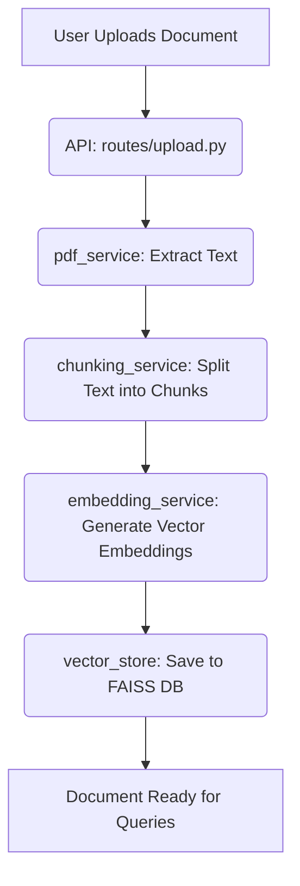
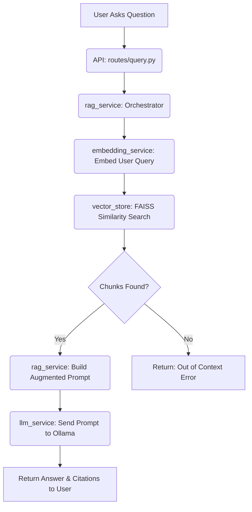

# 🏗️ RAG Document Assistant: Architecture & Pipelines

This document provides a comprehensive overview of how the codebase is structured and how the internal pipelines operate for document processing and RAG (Retrieval-Augmented Generation) queries.

---

## 📁 Code Structure Overview

The project is split into a **Backend** (FastAPI, Python) and a **Frontend** (React + Vite, JavaScript).

### Backend Structure (`/backend`)
The backend is responsible for API routing, document processing (chunking, embedding), vector storage (FAISS), and interacting with the local LLM via Ollama.

- **`main.py`**: The entry point of the FastAPI application. It configures the server, mounts the CORS middleware, and includes the routing modules.
- **`config.py`**: Handles configuration and environment variables (loaded from `.env`), such as the model name (`OLLAMA_MODEL`), chunk size, and paths to data directories.
- **`/routes`**: Contains the API endpoints.
  - `upload.py`: Handles POST requests for document uploads.
  - `query.py`: Handles POST requests for answering questions based on documents.
  - `documents.py`: Manages endpoints for retrieving document metadata or deleting documents.
- **`/services`**: Contains the core business logic.
  - `rag_service.py`: Orchestrates the entire query pipeline (retrieval + generation).
  - `llm_service.py`: Interfaces with the local Ollama instance (using models like `llama3.2:1b`).
  - `embedding_service.py`: Handles converting text into numerical vectors using SentenceTransformers (`all-MiniLM-L6-v2`).
  - `vector_store.py`: Manages the FAISS vector database (storing and searching embeddings).
  - `pdf_service.py`: Extracts text and layout information from uploaded PDFs (and presentations) using PyMuPDF.
  - `chunking_service.py`: Splits large documents into smaller, manageable text chunks with overlap.
- **`/utils`**: Helper scripts.
  - `file_handler.py`: Utility functions for securely saving files, managing directories, and ensuring paths are correct.
- **`/data`**: Local storage for uploaded files, FAISS indexes, and document metadata.

### Frontend Structure (`/frontend`)
The frontend is a modern React application utilizing Vite for fast bundling.

- **`src/App.jsx`**: The main application component that handles routing/view switching between the Landing Page and the main Workspace (Chat interface).
- **`src/components/`**: Modular UI components.
  - `LandingPage.jsx`: The professional, Hugging Face-inspired entry page.
  - `Navbar.jsx`: Top navigation bar.
- **`src/index.css`**: Defines the custom design system (dark theme, variables, component styles) using vanilla CSS.
- **`package.json`** & **`vite.config.js`**: Standard Node.js and Vite configuration for dependencies and building.

---

## 🔄 The Pipelines

There are two primary pipelines in this application: **Document Ingestion** and **RAG Querying**.

### 1. Document Ingestion Pipeline
When you upload a document (PDF or PPTX), the system needs to process it so the AI can understand it later.

1. **Extraction (`pdf_service.py`)**: The raw document is parsed. Text is extracted slide-by-slide or page-by-page.
2. **Chunking (`chunking_service.py`)**: The text is broken down into smaller pieces (e.g., 500 characters) with some overlap (e.g., 100 characters). This ensures that a single chunk isn't too large for the LLM to process, but doesn't cut off important context midway through a sentence.
3. **Embedding (`embedding_service.py`)**: Each text chunk is passed through an embedding model (`all-MiniLM-L6-v2`) to convert the semantic meaning of the text into a numerical vector (a list of numbers).
4. **Storage (`vector_store.py`)**: These vectors are saved in a local FAISS (Facebook AI Similarity Search) database, along with metadata (which document it belongs to, what page it came from, and the original text).

### 2. RAG Query Pipeline
When you ask a question in the chat interface, the system uses **Retrieval-Augmented Generation (RAG)** to find the answer.

1. **Intent Detection (`rag_service.py`)**: The system first quickly analyzes your question to see if it's asking for a specific type of information (like "who are the team members?" or "summarize this project").
2. **Query Embedding (`embedding_service.py`)**: Your question is converted into a vector using the *exact same model* used during ingestion.
3. **Similarity Search (`vector_store.py`)**: The system compares your question's vector against all the document vectors in the FAISS database to find the "Top K" chunks of text that are most semantically similar to your question.
4. **Prompt Construction (`rag_service.py`)**: The most relevant text chunks are gathered and injected into a strict "Prompt Template". The prompt tells the LLM: *"You are an AI assistant. Use ONLY the following Document Context to answer the User Inquiry."*
5. **Generation (`llm_service.py`)**: The heavily structured prompt is sent to the local Ollama model (e.g., `llama3.2:1b`). The LLM reads the provided context and synthesizes a natural language answer.
6. **Response**: The answer, along with the source citations (the original chunks and page numbers that were used), is returned to the frontend.

---

> [!TIP]
> **Why is it structured this way?**
> By separating concerns (putting LLM logic in `llm_service`, embedding in `embedding_service`, and orchestration in `rag_service`), the system is highly modular. If you ever wanted to switch from FAISS to a cloud database (like Pinecone) or from Ollama to OpenAI, you only need to update one specific service file, leaving the rest of the application completely untouched!
